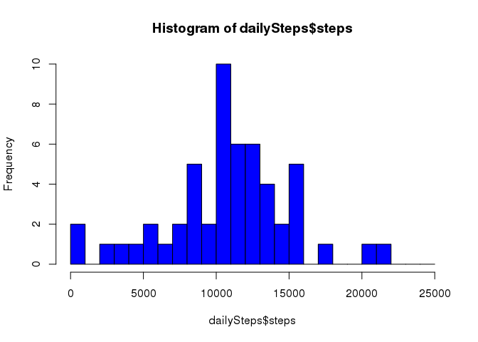

# Reproducible Research: Peer Assessment 1

## Loading and preprocessing the data

### Initializations

Make some initial environmental settings for the script. This makes sure we have needed libraries loaded and key script variables set. Specifically, we expect the data to be in our working directory. The same directory from which our R script is running. That needs to be set.  When running this script on your computer, set the *working_dir* variable accordingly, so that you can reproduce the output. It is the only thing that needs to be changed.


```r
# load the dplyr library
library(dplyr)
```

```
## 
## Attaching package: 'dplyr'
## 
## The following object is masked from 'package:stats':
## 
##     filter
## 
## The following objects are masked from 'package:base':
## 
##     intersect, setdiff, setequal, union
```

```r
# set working_dir variable
working_dir <- "~/Documents/courses/repdata/RepData_PeerAssessment1"

# set working directory
setwd(working_dir)
```

### Load the data


```r
# read the data
activity <- read.csv("activity.csv") 
```


### Preprocess the data

In order to produce histogram and calculate the mean and median, we first compute the sum of steps for each date. 


```r
# get totalSteps by date
totalSteps <- aggregate(steps ~ date, activity, sum)
meanSteps <- mean(totalSteps$steps)
medianSteps <- median(totalSteps$steps)
```

## What is mean total number of steps taken per day?

1. The historgam of the total number of step taken.


```r
hist(totalSteps$steps, breaks=seq(0,25000,1000), col="BLUE")
```

 

1. The **mean** and **median** of total number of steps taken per day.
  1. Mean: 1.0766189\times 10^{4}
  1. Median: 10765
  
## What is the average daily activity pattern?


## Imputing missing values


## Are there differences in activity patterns between weekdays and weekends?
